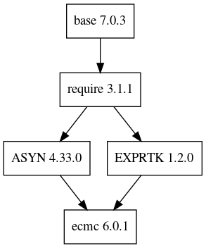

# Deprecation notice

2020-08-21: This remote has been deprecated. Moved to https://gitlab.esss.lu.se/e3/ecat/e3-ecmc

e3-ecmc 
======
ESS Site-specific EPICS module : ecmc

## Dependency Plot

||
| :---: |
|**Figure 1** Depdendency Tree. |

## Requirements

One should setup the etherlabmaster first.

https://github.com/icshwi/etherlabmaster
